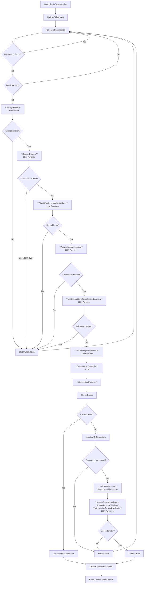

# [copcrawler.com](https://copcrawler.com/)

Some code snippets of the audio preprocessing, transcription, incident classification, and 
geocoding workflow for copcrawler.com. 

## LLM classification & geocoding 

## LLM Functions Overview

### 1. **JustifyIncident** (`gpt-4o-mini`)
- **Input**: Transcript text
- **Output**: `extract_incident` (boolean)
- **Purpose**: Determines if transcript contains actionable police/fire/ems information

### 2. **ClassifyIncident** (`gpt-4o-mini`)  
- **Input**: Transcript text
- **Output**: `type_of_incident`, `meta_category`, `description`
- **Purpose**: Classifies incident type and meta-category

### 3. **CheckForGeocodeableAddress** (`gpt-4o-mini`)
- **Input**: Transcript text  
- **Output**: `has_address` (boolean)
- **Purpose**: Determines if transcript contains a geocodeable address

### 4. **ExtractIncidentLocation** (`gpt-4o-mini`)
- **Input**: Transcript text
- **Output**: `extracted_location`, `address_type`, `confidence_score`
- **Purpose**: Extracts location information and classifies address type

### 5. **ValidateIncidentClassificationLocation** (`gpt-4o`)
- **Input**: Transmission text, type of incident, extracted location
- **Output**: `is_valid` (boolean)
- **Purpose**: Cross-validates that extracted location matches incident classification

### 6. **IncidentKeywordSelector** (`gpt-4o-mini`)
- **Input**: Transcript text, valid keywords list
- **Output**: `relevant_keywords` (array)
- **Purpose**: Selects semantically relevant keywords from predefined list

### 7. **Geocode Validators** (`gpt-4o-mini`)
- **NormalGeocodeValidator**: Validates standard address geocoding
- **PlaceGeocodeValidator**: Validates place/landmark geocoding  
- **IntersectionGeocodeValidator**: Validates intersection geocoding
- **Input**: LLM extracted address, geocoded address
- **Output**: `is_valid` (boolean)
- **Purpose**: Ensures geocoding service results match LLM extracted addresses

## Workflow Summary

The system processes radio transmissions through a multi-stage LLM pipeline:

1. **Pre-processing**: Split transmissions by talkgroups, filter duplicates/empty
2. **Justification**: Determine if transmission is actionable
3. **Classification**: Categorize incident type and severity
4. **Address Detection**: Check for geocodeable addresses
5. **Location Extraction**: Extract specific location details
6. **Cross-validation**: Verify location matches classification
7. **Keyword Selection**: Extract relevant trigger keywords
8. **Geocoding**: Convert addresses to coordinates with validation
9. **Output**: Generate simplified incident records for dashboard display

The pipeline uses 7 different LLM functions with robust validation and caching to ensure high-quality incident data extraction from scanner audio transcripts.